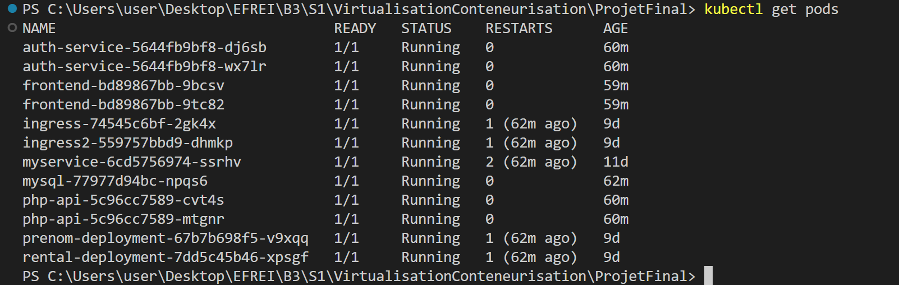
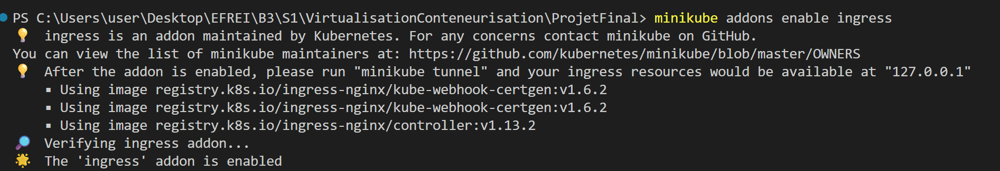
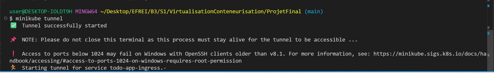
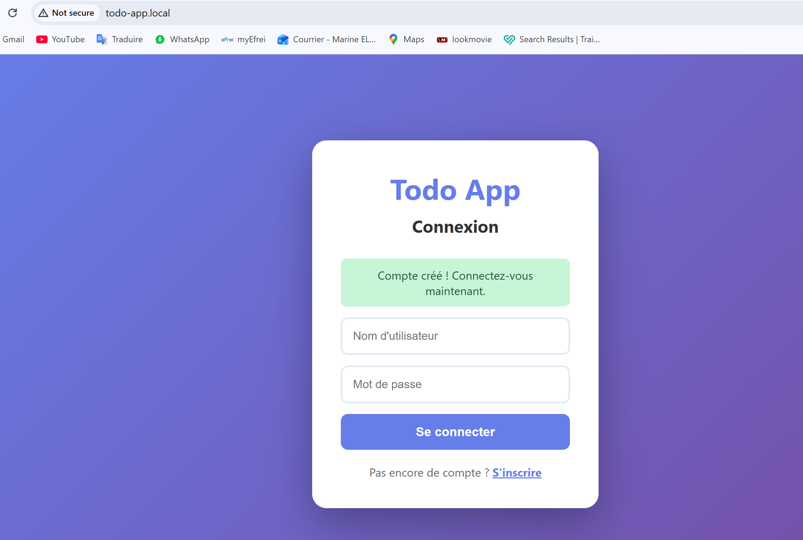
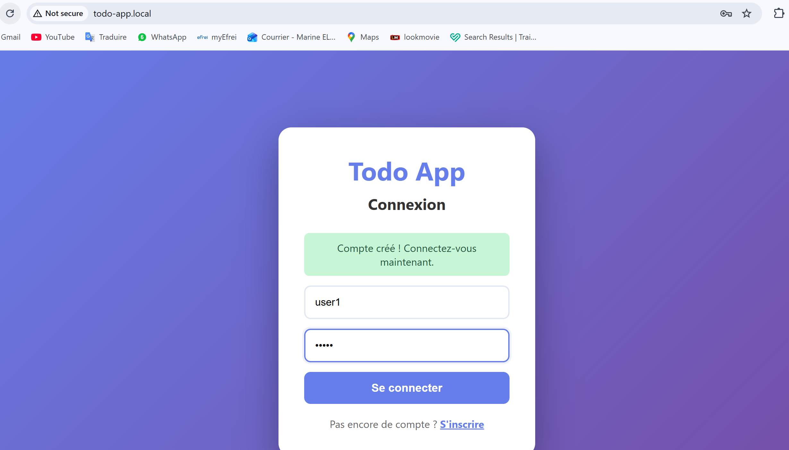
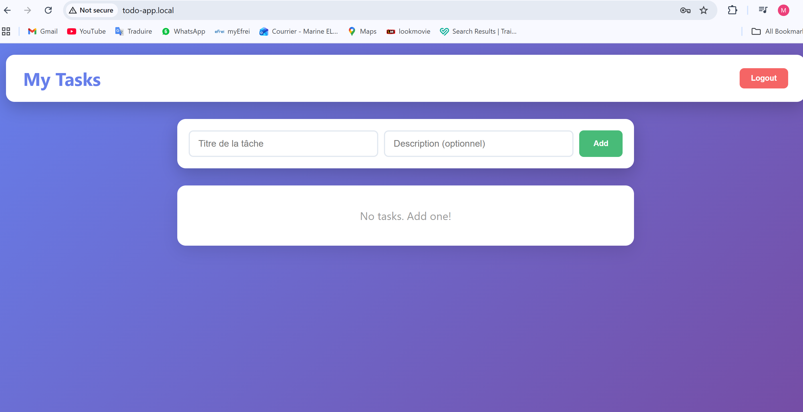
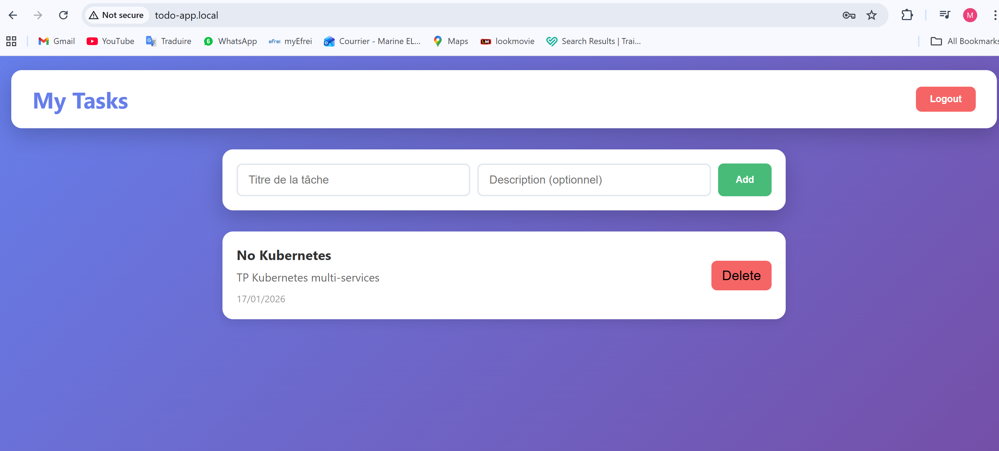

# Mini Application - Todo Liste - Kubernetes

Ce projet est une mini application "Todo List" basée sur une architecture microservices, conteneurisée avec Docker et orchestrée via Kubernetes

## Architecture
Ce projet est composé de 4 services:
- Service Frontend (frontendService) : Application React.js (Interface utilisateur)
- Service d'authentification (authService) : API Nodejs (Gestion de l'authentification & JWT)
- Service PHP (php-apiService) : API PHP native (Gestion des tâches)
- Service MySQL : Base de données relationnelle 

Tous ces services sont exposés via Ingress sur l'URL http://todo-app.local

## Prérequis & Installation

### 1. Démarrage du Cluster
Lancement de l'environnement local avec Minikube.
```bash
minikube start
```

### 2. Construction des Images Docker
Chaque microservice possède son propre ```Dockerfile```. Nous construisons les images pour le Frontend, l'API PHP et le Service d'Auth.

- Connexion au registre Docker Hub pour héberger les images:
```bash
docker login
```

- Image Frontend
```bash
cd frontendService
docker build -t marineesta/react-frontend:v1 .
docker push marineesta/react-frontend:v1
```
On retrouve l'image du frontend sur ```DockerHub``` : 

https://hub.docker.com/repository/docker/marineesta/react-frontend/general

- Image PHP
```bash
cd php-apiService
docker build -t marineesta/php-todo-api:v1 .
docker push marineesta/php-todo-api:v1
```
On retrouve l'image du service php sur ```DockerHub``` :

https://hub.docker.com/repository/docker/marineesta/php-todo-api/general

- Image Auth Service
```bash
cd authService
docker build -t marineesta/auth-service:v1 .
docker push marineesta/auth-service:v1
```
On retrouve l'image du service d'authentification sur ```DockerHub``` : 
https://hub.docker.com/repository/docker/marineesta/auth-service/general

## Déploiement sur Kubernetes
### 1. Application des fichier yml
Nous déployons les services dans l'ordre (Base de données, puis APIs, puis Frontend, puis Ingress).
```bash
# Déploiement de MySQL
kubectl apply -f mysql/mysql.yml

# Déploiement des Services Applicatifs
kubectl apply -f authService/kubernetes.yml
kubectl apply -f php-apiService/kubernetes.yml
kubectl apply -f frontendService/kubernetes.yml

# Configuration de l'Ingress
kubectl apply -f kubernetes/ingress.yml
```

### 2. Vérification des Pods
On s'assure que tous les pods sont en statut Running et que la base de données est prête.
```bash
kubectl get pods
```


## Configuration Réseau & Accès

### 1. Activation de l'Ingress
Pour que l'URL locale fonctionne, l'addon Ingress doit être activé dans Minikube, et l'on doit ajouter l'adresse dans le fichier hosts (```C:\Windows\System32\drivers\etc\hosts```).

- Ouvrir le bloc note en tant qu'administrateur et y ajouter cette ligne:
```127.0.0.1 todo-app.local```

- Activer ingress
```bash
minikube addons enable ingress
```


### 2. Tunnel et DNS
Lancement du tunnel pour exposer le cluster sur l'hôte:
```bash
minikube tunnel
```


## Résultat
### Page d'Inscription / Connexion
L'application est accessible sur http://todo-app.local. L'utilisateur arrive sur la page d'authentification gérée par le service Node.js.

#### Inscription


#### Inscription Reussie



#### Connexion 



#### Tasks

- Accueil



- Ajouter une tache


- Ajout de la tache OK



